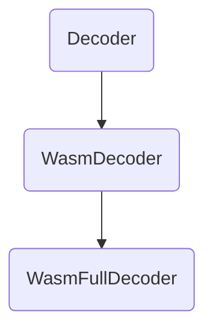

# Liftoff Implementation

[TOC]

Notes: 
1. all the code-pieces are trimmed. 

2. `///` means **editor added note**.

Directory covered in the report: `v8/src/wasm`

## Main Entrance

`src/wasm/baseline/liftoff-compiler.cc`

```c++
WasmCompilationResult ExecuteLiftoffCompilation(
    AccountingAllocator* allocator, 
    CompilationEnv* env,
    const FunctionBody& func_body, 
    int func_index, 
    ForDebugging for_debugging,
    Counters* counters, 
    WasmFeatures* detected, 
    Vector<int> breakpoints,
    std::unique_ptr<DebugSideTable>* debug_sidetable, 
    int dead_breakpoint) 
{
  /// get function body size
  int func_body_size = static_cast<int>(func_body.end - func_body.start);

  /// allocate small memory very quickly with {Zone}
  Zone zone(allocator, "LiftoffCompilationZone");
  auto call_descriptor = 
      compiler::GetWasmCallDescriptor(&zone, func_body.sig);
  size_t code_size_estimate =
      WasmCodeManager::EstimateLiftoffCodeSize(func_body_size);
  // Allocate the initial buffer a bit bigger to avoid reallocation during code
  // ...
  /// decoder coming:
  WasmFullDecoder<Decoder::kBooleanValidation, LiftoffCompiler> decoder(
      &zone, env->module, env->enabled_features, detected, func_body,
      call_descriptor, env, &zone, instruction_buffer->CreateView(),
      debug_sidetable_builder.get(), for_debugging, func_index, breakpoints,
      dead_breakpoint);
  /// important!(decoder.Decode(), decoder.interface()) 
  decoder.Decode();
  /// important!(LiftoffCompiler* compiler)
  LiftoffCompiler* compiler = &decoder.interface();
  if (decoder.failed()) {
    compiler->OnFirstError(&decoder);
    return WasmCompilationResult{};
  }

  // ...
    
  /// empty result will be returned if bailout
  if (compiler->did_bailout()) return WasmCompilationResult{};

  /// get the results
  WasmCompilationResult result;
  compiler->GetCode(&result.code_desc);
  result.instr_buffer = instruction_buffer->ReleaseBuffer();
  result.source_positions = compiler->GetSourcePositionTable();
  result.protected_instructions_data = compiler->GetProtectedInstructionsData();
  result.frame_slot_count = compiler->GetTotalFrameSlotCountForGC();
  result.tagged_parameter_slots = call_descriptor->GetTaggedParameterSlots();
  result.func_index = func_index;
  result.result_tier = ExecutionTier::kLiftoff;
  result.for_debugging = for_debugging;
  if (debug_sidetable) {
    *debug_sidetable = debug_sidetable_builder->GenerateDebugSideTable();
  }

  DCHECK(result.succeeded());
  return result;
}
```

## Start with the Result

`src/wasm/function-compiler.h`

```c++
struct WasmCompilationResult {
 public:
  MOVE_ONLY_WITH_DEFAULT_CONSTRUCTORS(WasmCompilationResult);

  enum Kind : int8_t {
    kFunction,
    kWasmToJsWrapper,
  };

  bool succeeded() const { return code_desc.buffer != nullptr; }
  bool failed() const { return !succeeded(); }
  operator bool() const { return succeeded(); }

  CodeDesc code_desc;
  std::unique_ptr<uint8_t[]> instr_buffer;
  uint32_t frame_slot_count = 0;
  uint32_t tagged_parameter_slots = 0;
  OwnedVector<byte> source_positions;
  OwnedVector<byte> protected_instructions_data;
  int func_index = kAnonymousFuncIndex;
  ExecutionTier requested_tier;
  ExecutionTier result_tier;
  Kind kind = kFunction;
  ForDebugging for_debugging = kNoDebugging;
};
```
Notice the `CodeDesc` in this struct. It stores the instructions and metadata.

### Enum Settings

Forms of `WasmCompilationResult` in `src/wasm/function-compiler.h` :
```c++
enum Kind : int8_t {
  kFunction,
  kWasmToJsWrapper,
};
```


Tiers and Debugging in `src/wasm/wasm-tier.h` :
```c++
// All the tiers of Wasm execution.
enum class ExecutionTier : int8_t {
  kNone,
  kLiftoff,
  kTurbofan,
};

// {kForDebugging} is used for default tiered-down code, {kWithBreakpoints} if
// the code also contains breakpoints, and {kForStepping} for code that is
// flooded with breakpoints.
enum ForDebugging : int8_t {
  kNoDebugging = 0,
  kForDebugging,
  kWithBreakpoints,
  kForStepping
};
```

Flags defined in these files correspond to the command line flags:

`$d8 ./test.js --liftoff --no-wasm-tier-up --print-wasm-code`

note that this is also the way to debug wasm code in v8.

### Buffer described in `CodeDesc`

`src/codegen/code-desc.h`

```c++
// A CodeDesc describes a buffer holding instructions and relocation
// information. The instructions start at the beginning of the buffer
// and grow forward, the relocation information starts at the end of
// the buffer and grows backward. Inlined metadata sections may exist
// at the end of the instructions.
//
//  |<--------------- buffer_size ----------------------------------->|
//  |<---------------- instr_size ------------->|      |<-reloc_size->|
//  |--------------+----------------------------+------+--------------|
//  | instructions |         data               | free |  reloc info  |
//  +--------------+----------------------------+------+--------------+
```

The accurate buffer map, however, is a bit more complicated. We can see from the source code that `instr_size` is actually divided into five sections:

1. `instruction_table`: just normal instructions which can be optimized
2. `safepoint_table`: records non-optimizing functions
3. `handler_table`: maintains a dynamic symbol table that links to external functions and libraries
4. `constant_pool`: constants.
5. `code_comments`: code debug info that can be printed in logs.

In the description above, `instrutions` is stored as “instructions” in the graph, while the rest are all “data” in the graph.

### How the result of compilation is presented

The functions and tables are stored in the `instr_buffer`.

Moreover, the `source_position` and `protected_instr_data` are also stored in the `OwnedVector` type. One may find it trivial at first, but they are not unnecessary. Turbofan will take advantage of this source-instruction pair relationship and optimize the instructions function by function.


## Input Format 

### Compiling Source: `FunctionBody`

`src/wasm/function-body-decoder.h`
```c++
// A wrapper around the signature and bytes of a function.
struct FunctionBody {
  const FunctionSig* sig;  // function signature
  uint32_t offset;         // offset in the module bytes, for error reporting
  const byte* start;       // start of the function body
  const byte* end;         // end of the function body

  FunctionBody(const FunctionSig* sig, uint32_t offset, const byte* start,
               const byte* end)
      : sig(sig), offset(offset), start(start), end(end) {}
};

```

### A higher viewpoint: `WasmFunction`

`src/wasm/wasm-module.h`
```c++
// Reference to a string in the wire bytes.
class WireBytesRef {
 public:
  WireBytesRef() : WireBytesRef(0, 0) {}
  WireBytesRef(uint32_t offset, uint32_t length)
      : offset_(offset), length_(length) {
    DCHECK_IMPLIES(offset_ == 0, length_ == 0);
    DCHECK_LE(offset_, offset_ + length_);  // no uint32_t overflow.
  }

  uint32_t offset() const { return offset_; }
  uint32_t length() const { return length_; }
  uint32_t end_offset() const { return offset_ + length_; }
  bool is_empty() const { return length_ == 0; }
  bool is_set() const { return offset_ != 0; }

 private:
  uint32_t offset_;
  uint32_t length_;
};

// Static representation of a wasm function.
struct WasmFunction {
  const FunctionSig* sig;  // signature of the function.
  uint32_t func_index;     // index into the function table.
  uint32_t sig_index;      // index into the signature table.
  WireBytesRef code;       // code of this function.
  bool imported;
  bool exported;
  bool declared;
};
```


## Memory Allocation: `Zone`

`src/zone/zone.h`
```c++
// The Zone supports very fast allocation of small chunks of
// memory. The chunks cannot be deallocated individually, but instead
// the Zone supports deallocating all chunks in one fast
// operation. The Zone is used to hold temporary data structures like
// the abstract syntax tree, which is deallocated after compilation.
//
// Note: There is no need to initialize the Zone; the first time an
// allocation is attempted, a segment of memory will be requested
// through the allocator.
//
// Note: The implementation is inherently not thread safe. Do not use
// from multi-threaded code.
```

## Wasm OpCode

`src/wasm/wasm-opcodes.h`

```c++
/// a lot of wasm instructions are defined in this file using macros.
#define FOREACH_SIMPLE_BINOP(V) \
  V(I32Add, uint32_t, +)        \
  V(I32Sub, uint32_t, -)        \
  V(I32Mul, uint32_t, *)        \
// ...

enum WasmOpcode {
// Declare expression opcodes.
#define DECLARE_NAMED_ENUM(name, opcode, sig) kExpr##name = opcode,
  FOREACH_OPCODE(DECLARE_NAMED_ENUM)
#undef DECLARE_NAMED_ENUM
#define DECLARE_PREFIX(name, opcode) k##name##Prefix = opcode,
      FOREACH_PREFIX(DECLARE_PREFIX)
#undef DECLARE_PREFIX
};
// ...

// A collection of opcode-related static methods.
class V8_EXPORT_PRIVATE WasmOpcodes {
 public:
  static constexpr const char* OpcodeName(WasmOpcode);
  static constexpr const FunctionSig* Signature(WasmOpcode);
  static constexpr const FunctionSig* AsmjsSignature(WasmOpcode);
  static constexpr bool IsPrefixOpcode(WasmOpcode);
  static constexpr bool IsControlOpcode(WasmOpcode);
  static constexpr bool IsExternRefOpcode(WasmOpcode);
  static constexpr bool IsThrowingOpcode(WasmOpcode);
  static constexpr bool IsSimdPostMvpOpcode(WasmOpcode);
  // Check whether the given opcode always jumps, i.e. all instructions after
  // this one in the current block are dead. Returns false for |end|.
  static constexpr bool IsUnconditionalJump(WasmOpcode);
  static constexpr bool IsBreakable(WasmOpcode);

  static constexpr MessageTemplate TrapReasonToMessageId(TrapReason);
  static inline const char* TrapReasonMessage(TrapReason);
};

```

## Decoder: `WasmFullDecoder`

### Hierarchy



### Liftoff Function Compiler

`src/wasm/function-body-decoder-impl.h`
```c++
class WasmFullDecoder : public WasmDecoder<validate> {
  
  // ...

  void DecodeFunctionBody() {
    TRACE("wasm-decode %p...%p (module+%u, %d bytes)\n", this->start(),
          this->end(), this->pc_offset(),
          static_cast<int>(this->end() - this->start()));

    // Set up initial function block.
    {
      Control* c = PushControl(kControlBlock);
      InitMerge(&c->start_merge, 0, [](uint32_t) -> Value { UNREACHABLE(); });
      InitMerge(&c->end_merge,
                static_cast<uint32_t>(this->sig_->return_count()),
                [&](uint32_t i) {
                  return Value{this->pc_, this->sig_->GetReturn(i)};
                });
      CALL_INTERFACE(StartFunctionBody, c);
    }

    // Decode the function body.
    while (this->pc_ < this->end_) {
      // Most operations only grow the stack by at least one element (unary and
      // binary operations, local.get, constants, ...). Thus check that there is
      // enough space for those operations centrally, and avoid any bounds
      // checks in those operations.
      EnsureStackSpace(1);
      uint8_t first_byte = *this->pc_;
      WasmOpcode opcode = static_cast<WasmOpcode>(first_byte);
      /// The following call Decode and use platform-based instrs.
      CALL_INTERFACE_IF_REACHABLE(NextInstruction, opcode); 
      /// Iterate.
      OpcodeHandler handler = GetOpcodeHandler(first_byte);
      int len = (*handler)(this, opcode);
      this->pc_ += len;
    }

    if (!VALIDATE(this->pc_ == this->end_)) {
      this->DecodeError("Beyond end of code");
    }
  }

  // ...

};
```


## Consumers

The following will decide whether to use Turbofan Compilation or Liftoff Compilation: 

`src/wasm/function-compiler.h`

```c++
WasmCompilationResult WasmCompilationUnit::ExecuteFunctionCompilation(
    WasmEngine* wasm_engine, CompilationEnv* env,
    const std::shared_ptr<WireBytesStorage>& wire_bytes_storage,
    Counters* counters, WasmFeatures* detected);
```

A test for Liftoff Compilation:

`test/cctest/wasm/test-liftoff-inspection.cc`
```c++
class LiftoffCompileEnvironment {
  ...
  void CheckDeterministicCompilation(
      std::initializer_list<ValueType> return_types,
      std::initializer_list<ValueType> param_types,
      std::initializer_list<uint8_t> raw_function_bytes);
};
```

## Wasm Code Manager

`src/wasm/wasm-code-manager.h`
```c++
// Within the scope, the native_module is writable and not executable.
// At the scope's destruction, the native_module is executable and not writable.
// The states inside the scope and at the scope termination are irrespective of
// native_module's state when entering the scope.
// We currently mark the entire module's memory W^X:
//  - for AOT, that's as efficient as it can be.
//  - for Lazy, we don't have a heuristic for functions that may need patching,
//    and even if we did, the resulting set of pages may be fragmented.
//    Currently, we try and keep the number of syscalls low.
// -  similar argument for debug time.
class V8_NODISCARD NativeModuleModificationScope final {
 public:
  explicit NativeModuleModificationScope(NativeModule* native_module);
  ~NativeModuleModificationScope();

 private:
  NativeModule* native_module_;
};

// {WasmCodeRefScope}s form a perfect stack. New {WasmCode} pointers generated
// by e.g. creating new code or looking up code by its address are added to the
// top-most {WasmCodeRefScope}.
class V8_EXPORT_PRIVATE V8_NODISCARD WasmCodeRefScope {
 public:
  WasmCodeRefScope();
  WasmCodeRefScope(const WasmCodeRefScope&) = delete;
  WasmCodeRefScope& operator=(const WasmCodeRefScope&) = delete;
  ~WasmCodeRefScope();

  // Register a {WasmCode} reference in the current {WasmCodeRefScope}. Fails if
  // there is no current scope.
  static void AddRef(WasmCode*);

 private:
  WasmCodeRefScope* const previous_scope_;
  std::unordered_set<WasmCode*> code_ptrs_;
};

// Similarly to a global handle, a {GlobalWasmCodeRef} stores a single
// ref-counted pointer to a {WasmCode} object.
class GlobalWasmCodeRef {
 public:
  explicit GlobalWasmCodeRef(WasmCode* code,
                             std::shared_ptr<NativeModule> native_module)
      : code_(code), native_module_(std::move(native_module)) {
    code_->IncRef();
  }

  GlobalWasmCodeRef(const GlobalWasmCodeRef&) = delete;
  GlobalWasmCodeRef& operator=(const GlobalWasmCodeRef&) = delete;

  ~GlobalWasmCodeRef() { WasmCode::DecrementRefCount({&code_, 1}); }

  // Get a pointer to the contained {WasmCode} object. This is only guaranteed
  // to exist as long as this {GlobalWasmCodeRef} exists.
  WasmCode* code() const { return code_; }

 private:
  WasmCode* const code_;
  // Also keep the {NativeModule} alive.
  const std::shared_ptr<NativeModule> native_module_;
};
```


## Questions

What does `.cc` stand for?

What's the use of a constructor in a well-formed struct? e.g. `FunctionBody`

Why are the


